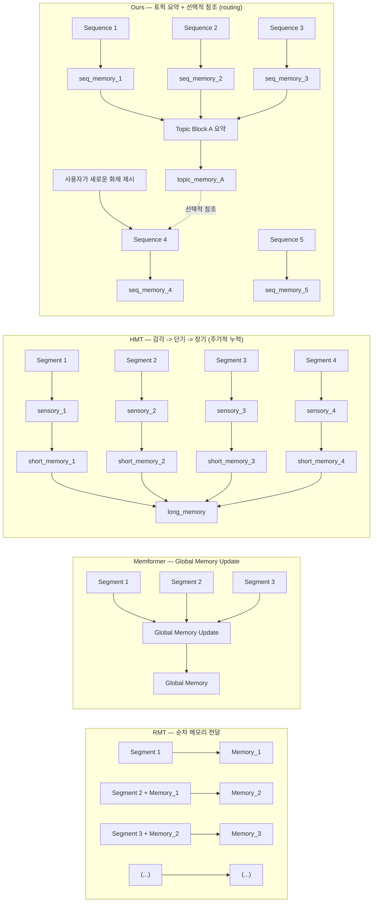

# 🧠 Transformer-XL Topic-Aware (TXL-TA)

이 프로젝트는 **Transformer-XL (TXL)**을 기반으로 **Topic-Aware Memory 구조**를 실험적으로 확장한 코드베이스입니다.  
Hugging Face Datasets 및 Tokenizers를 이용해 데이터 파이프라인을 단순화하고,  
세션 단위 기억 유지(Recall) 및 망각(Forgetting) 곡선을 평가할 수 있도록 구성되어 있습니다.

---

## 📁 프로젝트 구조
```plaintext
transformer-xl/
├─ txl/
│  ├─ mem_transformer.py     # 원본 그대로(복사본). 수정 금지
│  ├─ mem_transformer_ta.py  # Topic-Aware 수정본
│  └─ __init__.py
│
├─ txl_hf/
│  ├─ train_hf.py            # HF Trainer 기반 학습/평가 스크립트
│  ├─ collator_stream.py     # 스트리밍 Collator (세션 단위 처리)
│  ├─ build_dataset.py       # HF Dataset 생성 및 전처리
│  ├─ build_tokenizer.py     # BPE 기반 Tokenizer 빌드
│  ├─ utils_logging.py       # 로그 및 체크포인트 유틸리티
│  ├─ mem_baseline.py        # HF용 TXL 래퍼 (baseline)
│  ├─ mem_ta.py              # Topic-Aware Memory 적용 HF 래퍼
│  └─ __init__.py
│
├─ data/
│  ├─ aihub/                 # AI Hub 일상대화 데이터셋
│  ├─ kowiki/                # 한국어 Wikipedia 문서 데이터
│  └─ kodial/                # Ko-Dial (KoNLP 공개 대화 corpus)
│
├─ artifacts/
│  └─ tokenizer/
│     └─ ko_bpe.json         # 학습용 BPE 토크나이저 저장 파일
│
└─ logs/                     # 학습 및 평가 로그 저장 경로
```

---

## 🧩 모델 특징 요약

| 구분 | Transformer-XL (TXL) | Recurrent Memory Transformer (RMT) | Topic-Aware TXL (TA-TXL, Ours) |
|------|---------------------------------|---------------------------------|---------------------------------|
| 도입 배경 | 고정 context window 한계 극복을 위해 **segment recurrence** 도입 | TXL의 메모리 비효율 개선: **summary 기반 recurrence** | RMT의 무차별 누적 개선: **topic-aware 기억 제어** |
| 기억 단위 | 이전 **segment hidden 전체** | 이전 **segment summary token** | **Topic 단위 S/L memory** (short–long 분리) |
| 갱신 시점 | **매 segment** | **매 segment**(summary 생성 후) | **Topic 경계에서만 S→L 전이** |
| 참조 방식 | 과거 segment memory **전부 참조** | **요약 memory** 참조 | **현재 topic의 L만 routing**(선택적 참조) |
| 핵심 아이디어 | 긴 문맥 **연결** | 메모리 **효율** 향상 | **주제 지속성 유지 + 망각/간섭 제어** |
| 주요 효과 | 문맥 길이 ↑ | 메모리 사용량 ↓ | **기억 간섭 ↓ · 회상 정확도 ↑** |

---

## 🧠 구조 개념도 (Mermaid)

